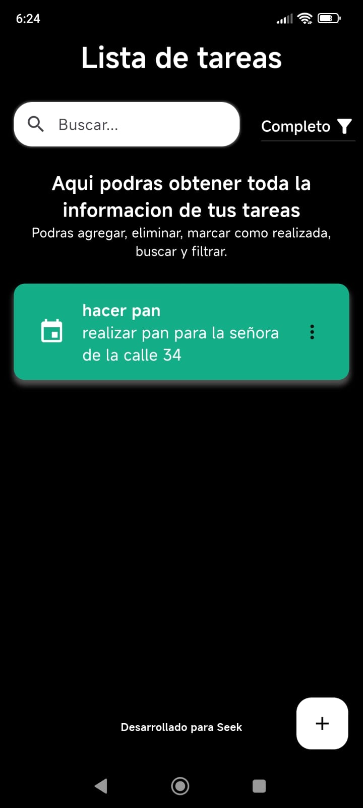
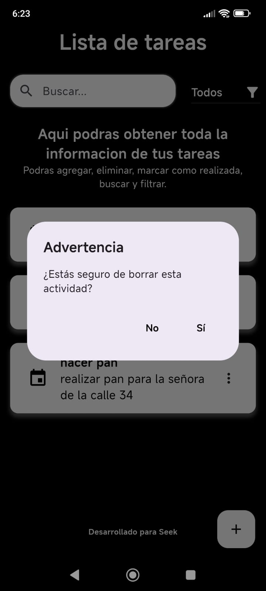
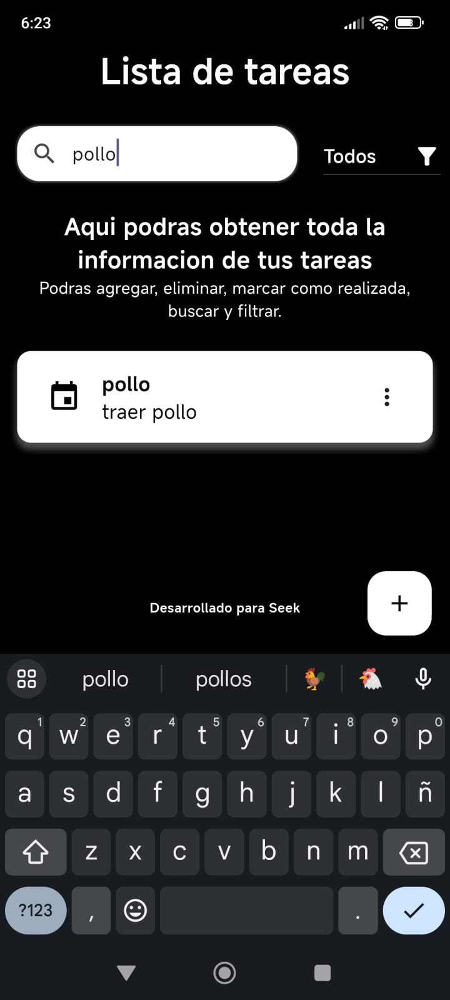
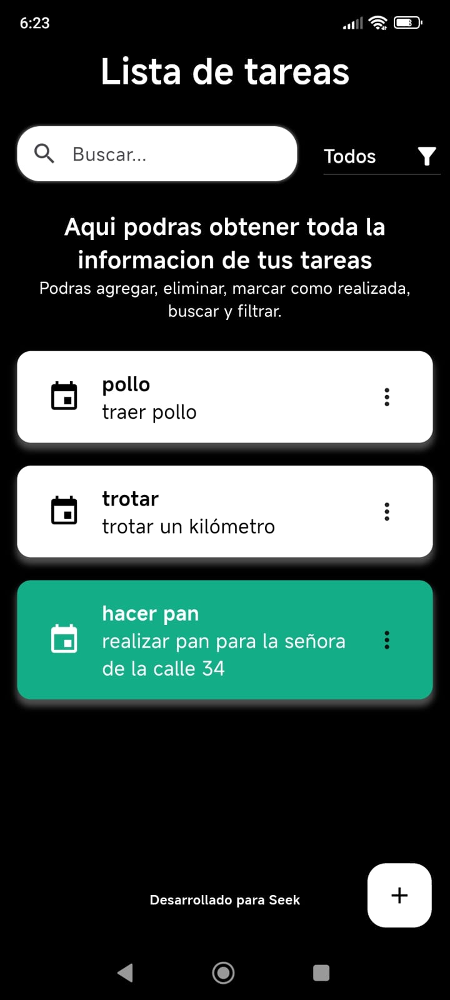
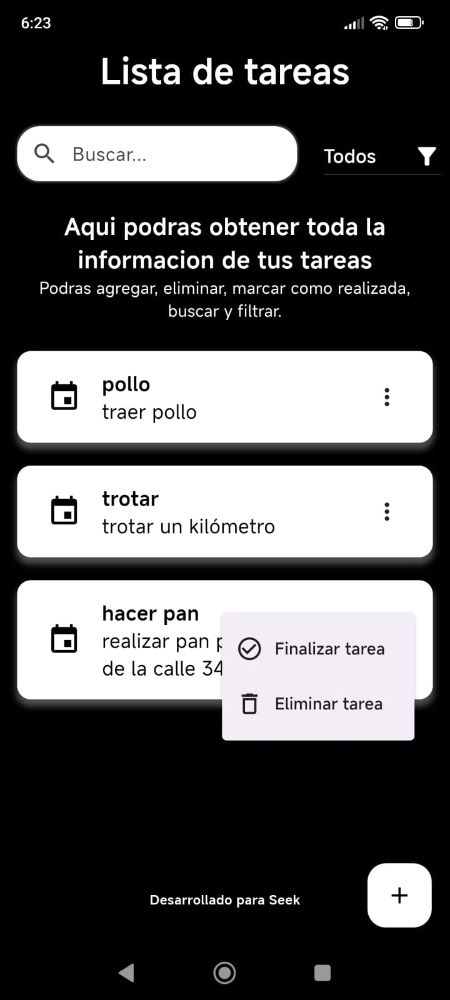
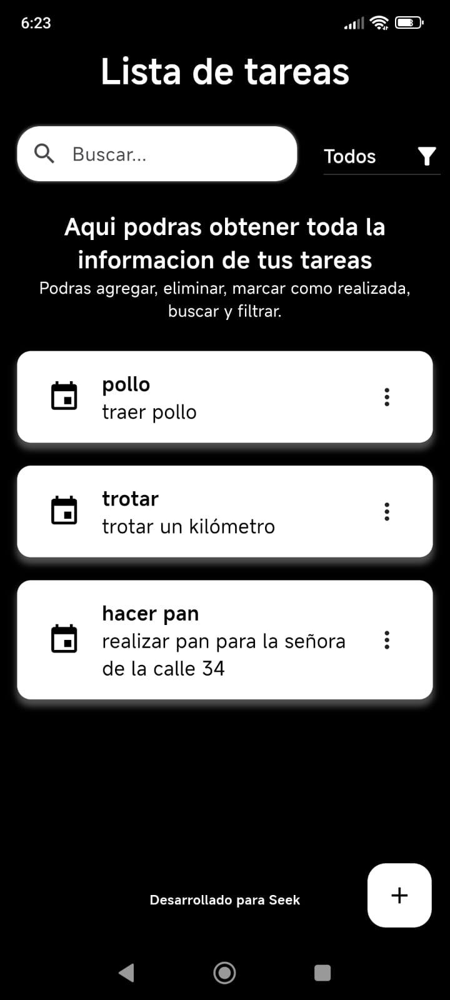

# Url para usar por app tester

- **Solicitar permisos para poner como verificadores.**
- <https://appdistribution.firebase.google.com/testerapps/1:517351588302:android:5b4cc6d2eee43ffaa72b9f/releases/79ap6ssli6odg?utm_source=firebase-console>

# Url para descargar por drive

- <https://drive.google.com/file/d/112z2xsBJ28DchEdiqGHGd5Efzhh6fsdD/view?usp=sharing>

# Aplicación de Lista de Tareas - Flutter

Este proyecto es una aplicación de lista de tareas desarrollada en Flutter como parte del Reto de Automatización para la posición de Mobile Developer.

## Contexto

Se requiere desarrollar una aplicación de lista de tareas utilizando Flutter que permita a los usuarios agregar, eliminar y marcar como completadas las tareas. La aplicación debe tener una arquitectura limpia y modular, siguiendo los principios de arquitectura hexagonal o similar. Además, se deben usar patrones de diseño apropiados y gestión de estado eficiente.

## Requerimientos Funcionales

- **Lista de Tareas**: Mostrar una lista de tareas pendientes.
- **Agregar Tarea**: Permitir a los usuarios agregar nuevas tareas.
- **Eliminar Tarea**: Permitir a los usuarios eliminar tareas existentes.
- **Marcar Tarea como Completada**: Permitir a los usuarios marcar las tareas como completadas.
- **Filtrado de Tareas**: Implementar la capacidad de filtrar las tareas por estado (pendientes/completadas).
- **Persistencia de Datos**: Las tareas deben persistir incluso después de cerrar y volver a abrir la aplicación.

## Requerimientos Técnicos

- **Arquitectura**: Utilizar una arquitectura limpia y modular, como arquitectura hexagonal o similar.
- **Patrones de Diseño**: Aplicar patrones de diseño apropiados para separar las preocupaciones y facilitar la escalabilidad y mantenibilidad del código.
- **Gestión de Estado**: Utilizar una solución eficiente para la gestión del estado de la aplicación, como Provider, Bloc o MobX.
- **Pruebas Unitarias**: Incluir pruebas unitarias para garantizar la calidad y la estabilidad del código.
- **Despliegue de APK**: Generar un archivo APK firmado y listo para desplegar en dispositivos Android.
- **Publicación en GitHub**: Publicar el código fuente en un repositorio de GitHub público, con instrucciones claras para ejecutar y probar la aplicación.

## Recomendaciones

- Crear una interfaz de usuario atractiva y fácil de usar.
- Utilizar un sistema de gestión de dependencias como Pub para manejar las dependencias del proyecto de manera efectiva.
- Agregar animaciones para mejorar la experiencia del usuario.
- Incluye instrucciones claras sobre cómo configurar y ejecutar la aplicación.
- Asegúrate de que el código sea legible y siga las mejores prácticas de desarrollo.
- Considera la modularidad y reutilización del código.
- Proporciona comentarios en el código donde sea necesario.


## Pasos para correr el proyecto

1. **Preparación del entorno**:
   - Asegúrate de tener Flutter instalado en tu sistema. Puedes verificar la instalación ejecutando `flutter doctor` en tu terminal.
   - Asegúrate de tener un emulador de Android o un dispositivo físico conectado para ejecutar la aplicación.
   - **Versión de Flutter**: Flutter (Channel stable, 3.16.5)

2. **Clonar el repositorio**:
   - Clona este repositorio en tu máquina local utilizando el siguiente comando:
     ```
     git clone https://github.com/Apirsito/Seek.git
     ```

3. **Instalar dependencias**:
   - Navega hasta el directorio del proyecto y ejecuta el siguiente comando para instalar todas las dependencias requeridas:
     ```
     flutter pub get
     ```

4. **Ejecutar la aplicación**:
   - Una vez que todas las dependencias estén instaladas, puedes ejecutar la aplicación en tu emulador o dispositivo utilizando el siguiente comando:
     ```
     flutter run
     ```

## Estructura del Proyecto

El proyecto sigue una estructura de carpetas basada en la separación de las capas de la aplicación:

- **Capa de Presentación**: Contiene todos los elementos relacionados con la interfaz de usuario y la presentación de la aplicación. Aquí se encuentran los widgets, páginas y cualquier componente relacionado con la interfaz de usuario.
- **Capa de Dominio**: Contiene la lógica de negocio de la aplicación. Aquí se definen los modelos de datos, los casos de uso y cualquier otra lógica que no esté directamente relacionada con la presentación ni con el almacenamiento de datos.
- **Capa de Datos**: Contiene la lógica relacionada con el acceso a datos y la persistencia de la aplicación. Aquí se encuentran los repositorios, las fuentes de datos y cualquier otra lógica relacionada con el manejo de datos.

Esta estructura ayuda a mantener el código organizado y facilita la escalabilidad y mantenibilidad del proyecto.


## Recursos adicionales

   - El archivo .jks se encuentra dentro de android/app/upload-keystore.jks
   
## Capturas de Pantalla













